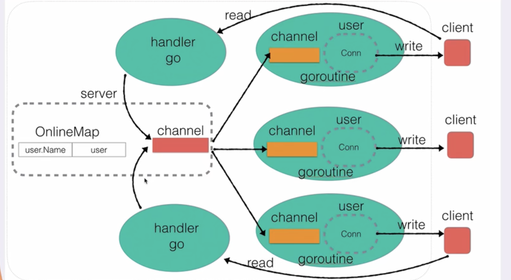

# 即时通讯系统


## 构建Server
基本的TCP套接字编程
```
listen() -> accept() 这里阻塞 -> read() -> write() -> close()
```

```go
// socket listen
listener, err := net.Listen("tcp", fmt.Sprintf("%s:%d", server.Ip, server.Port))
if err != nil {
    fmt.Println("net.Listen err: ", err)
    return
}
// close listen socket
defer listener.Close()
for {
    // accept
    conn, err := listener.Accept() // 阻塞
    if err != nil {
        fmt.Println("listener accept err: ", err)
        continue
    }
    // do handler
    go server.Handler(conn)
}
// close listen socket
```

## 用户上线以及广播
用户对象(对应图中的User)
```go
type User struct {
	Name string
	Addr string
	Ch   chan string
	conn net.Conn // socket
}
```
每次创建用户时，启动一个goroutine监听用户消息
```go
func (user *User) ListenMessage() {
	for {
		msg := <-user.Ch
		user.conn.Write([]byte(msg + "\n"))
	}
}
```
在server中维护一个用户列表并广播用户上线的消息

`ListenMessager`作为一个goroutine监听消息并广播。
这里用msg channel来接收消息，我的理解是为了避免多个
goroutine同时需要发送消息，channel可以确保消息的顺序。在访问`OnlineMap`时需要加锁，是为了确保并发访问时不会出现数据错乱，这里的锁是为了保证数据的一致性。
```go
func (server *Server) ListenMessager() {
	for {
		msg := <-server.Message
		server.mapLock.Lock()
		for _, cli := range server.OnlineMap {
			cli.Ch <- msg
		}
		server.mapLock.Unlock()
	}
}
```

## 用户消息广播
和c++的socket编程差不多
```go
// 接受客户端发送的消息
go func() {
    buf := make([]byte, 4096)
    for {
        n, err := conn.Read(buf) // 阻塞
        if n == 0 {
            server.BroadCast(user, "下线")
            conn.Close() // 这里可能server还需要发送一些消息，根据4次挥手的过程，这里可能会有问题
            // 应该在server发送完消息后再关闭连接
            return
        }
        if err != nil && err != io.EOF {
            fmt.Println("Conn Read err: ", err)
        }
        msg := string(buf[:n-1]) // 去掉'\n'
        server.BroadCast(user, msg)
    }
}()
```

## 用户业务封装
封装完上面的业务后，server的代码就会变得很简洁
```go
func (user *User) Online() {
	...
}

func (user *User) Offline() {
	...
}

func (user *User) HandleMessage(msg string) {
	...
}
```

## 在线用户查询
```go
func (user *User) HandleMessage(msg string) {
	if msg == "who" {
		...
	} else {
		user.server.BroadCast(user, msg)
	}
}
```

## 用户重命名
调用了`strings.Split()`函数，这个函数会返回一个slice，第一个元素是分割后的字符串，第二个元素是分割后的剩余字符串
```go
newName := strings.Split(msg, "|")[1]
```

## 超时强踢
每次用户调用Write()时，服务器的Read()不再阻塞，给isLive发送一个消息，重置定时器

每次在select中进入isLive时，都会调用`time.After()`函数，这个函数会返回一个channel，当定时器到时后，会向这个channel发送一个消息，这样就可以在select中进入`time.After()`时，重置定时器
```go
for {
    select {
    case <-isLive:
        // 每次进isLive都会将time.After调用一次，重制定时器
    case <-time.After(time.Minute):
        // 已经超时
        // 将当前的user强制关闭
        user.SendMsg("你已超时，已被踢出服务器")
        close(user.Ch)
        close(isLive)
        delete(server.OnlineMap, user.Name)
        conn.Close()
        return
    }
}
```
问题在于每次进入isLive case时，都会调用time.After，这会创建一个新的定时器。如果这个select语句被频繁执行，而且执行的间隔短于定时器的超时时间（在这个例子中是1分钟），那么确实有可能积累大量未完成的定时器，进而导致内存占用不断上升，最终可能出现OOM（Out Of Memory）问题。

更改如下
```go
timer := time.NewTimer(time.Minute)

for {
    select {
    case <-isLive:
        // 每次进isLive都重置定时器
        if !timer.Stop() {
            <-timer.C
        }
        timer.Reset(time.Minute)
    case <-timer.C: // 定时器到时间后，会向C发送当前时间
        // 已经超时
        // 将当前的user强制关闭
        user.SendMsg("你已超时，已被踢出服务器")
        close(user.Ch)
        close(isLive)
        delete(server.OnlineMap, user.Name)
        conn.Close()
        return
    }
}
```

## 用户私聊
在`HandleMessage()`中添加私聊的逻辑


## 客户端实现
用一个goroutine来接收消息
```go
func (client *Client) DealResponse() {
	// 一旦client.conn有数据，就copy到stdout输出上，永久阻塞监听
	io.Copy(os.Stdout, client.conn)
}
```
分别实现公聊私聊和改名的功能
